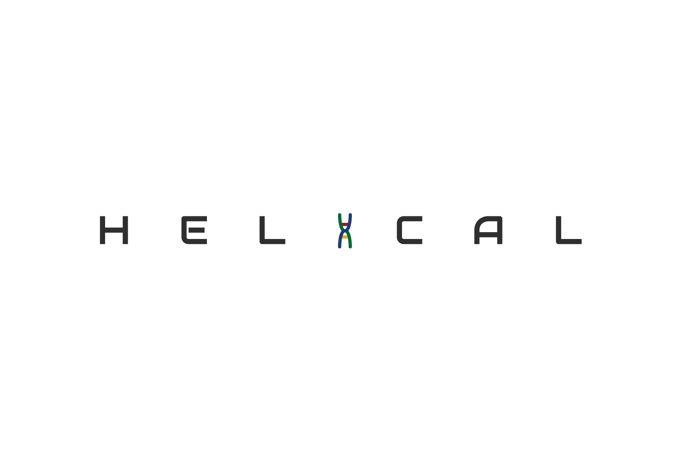

<h1 align="center">The HELiCAL Project</h1>

    
    
    
    
    
    

## Description

The **HELiCAL** project is a _bioinformatics-based utility_ - designed as a web app/utility - for biologists and technologists to work with biological data. 

The intent of the project is to provide basic, intermediate, and advanced _algorithmic operations for genomic data processing_ in an optimized and user-friendly manner. 

Through optimized algorithms design, modular programmatic complexity, and accessible code architectures, I aim to produce a _full-stack Python application_ that's open-source and serves an interesting and modern problem space. 

## Features (User Stories)

* [x] ~~Can enter custom genomic data in string format.~~
* [x] ~~Can process genomic data using up to one algorithm.~~
* [x] ~~Can receive processed results as response on the web page.~~
* [x] ~~Can process genomic data with up to three algorithms.~~
* [x] ~~Can process genomic data with up to five algorithms.~~
* [ ] Can process genomic data with up to ten algorithms.
* [ ] Can process genomic data with up to fifteen algorithms.
* [ ] Can process genomic data with up to twenty algorithms.
* [ ] Can upload genomic data in file format.
* [ ] Can receive processed results as returned file format.

## Dependencies

* [PEP8](http://pep8.readthedocs.io/en/release-1.7.x/)
* [Flask](https://github.com/pallets/flask)

## License

The content of this project itself and the source code used to format and display that content are both licensed under the MIT license.

## Acknowledgements

Thanks to **Alan Davis** ([@neptunius](https://github.com/neptunius)) for advising the project's development from inception to actualization. 

Thanks to **Wenzel Lowe** ([@lowewenzel](https://github.com/lowewenzel)) for designing the project's current logo(s).

Special thanks to [**Make School**](https://www.makeschool.com/) and their [**Product College**](https://www.makeschool.com/computer-science/academics) program for fostering personal growth and development in the realms of full-stack Python development, elementary computer science, and data science/engineering. 

## Credits

**HELiCAL** is created and maintained by _Aakash "Kash" Sudhakar_ (2019). 
